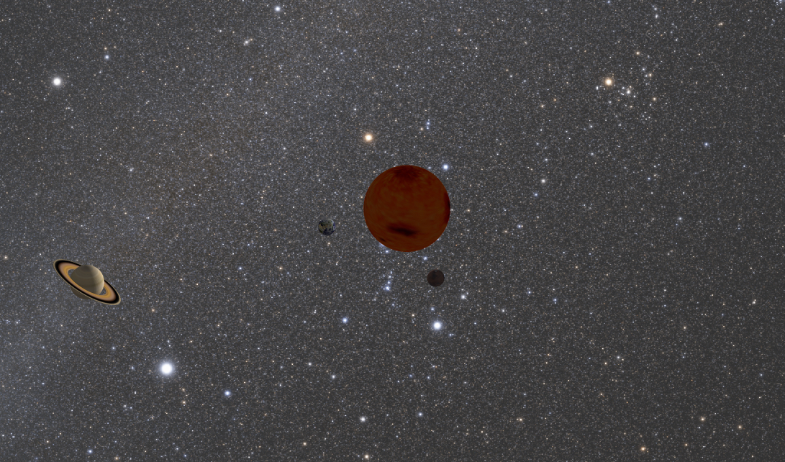

# SolarSystemSimulation

This is a simple model of our solar system written in MatLab. The code may work in Octave but compatibility is currently not guarantied. (We will probably fix that in the future)

As of now, trajectories are not calculated and the orbits are perfect circles. The sizes and distances are to scale, but just not the same. Choosing the same scale for size and distance would render things useless. You wouldn’t see anything.

The project is still under heavy development: errors are to be expected and things will probably not be perfect yet, but we’re working on it.

This is what it looks like:

(It’s called 'Solar System Simulation’ because it  just has a better ring to it than 'Solar System Model'...)
