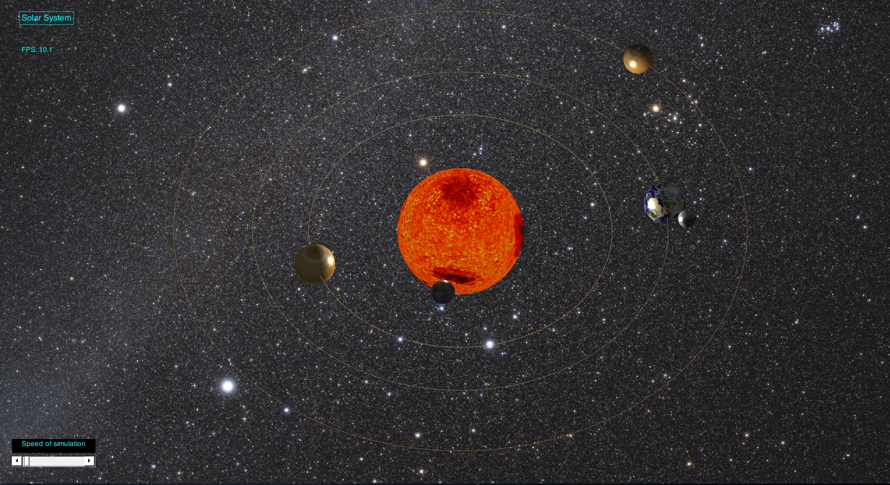

# SolarSystemSimulation

This is a simple model of our solar system written in MatLab. The code may work in Octave but compatibility is not guarantied.

With the release of version 1.0.0 we stoped active development of the project. Of course we didn't completely abandon the project, so, if you need anything just tell us (issue, pullrequest or whatever) and we'll see to it.

Trajectories are not calculated and the orbits are perfect circles, due to the simple fact that the difference would be hardly noticable. The sizes and distances are mostly to scale, but just not to the same scale. Choosing the same scale for size and distance would render things useless. You wouldn’t see anything. Furthermore we had to choose a logarithmic scale for the sizes, due to the same problem: else, you wouldn't see any thing.

This is what it looks like:

(It’s called 'Solar System Simulation’ because it just has a better ring to it than 'Solar System Model'...)
